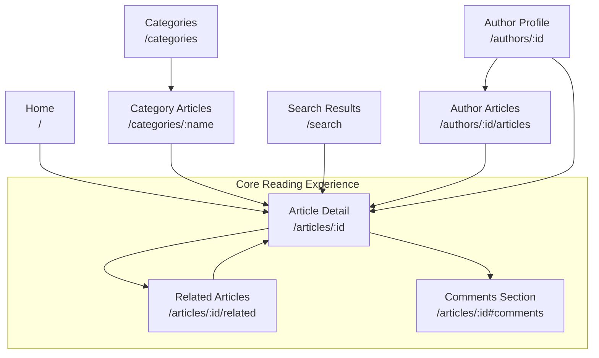

# User Flow — TechFlow Blog Platform

```mermaid
graph TD
  %% Primary Pages (accessible from main navigation or direct links)
  PageA["Home<br/>/"]
  PageB["Categories<br/>/categories"]
  PageC["Search Results<br/>/search"]
  PageD["Author Profile<br/>/authors/:id"]
  
  %% Detail and Action Pages (2 levels maximum)
  PageA --> PageA1["Article Detail<br/>/articles/:id"]
  
  %% Core Business Features (group the end-to-end value-delivering sequence)
  subgraph "Core Reading Experience"
    PageA1 --> PageA2["Related Articles<br/>/articles/:id/related"]
    PageA1 --> PageA3["Comments Section<br/>/articles/:id#comments"]
  end
  
  PageB --> PageB1["Category Articles<br/>/categories/:name"]
  PageB1 --> PageA1
  
  PageC --> PageA1
  
  PageD --> PageD1["Author Articles<br/>/authors/:id/articles"]
  PageD1 --> PageA1
  
  %% Cross-page Navigation (when applicable)
  PageA2 --> PageA1
  PageD --> PageA1
```